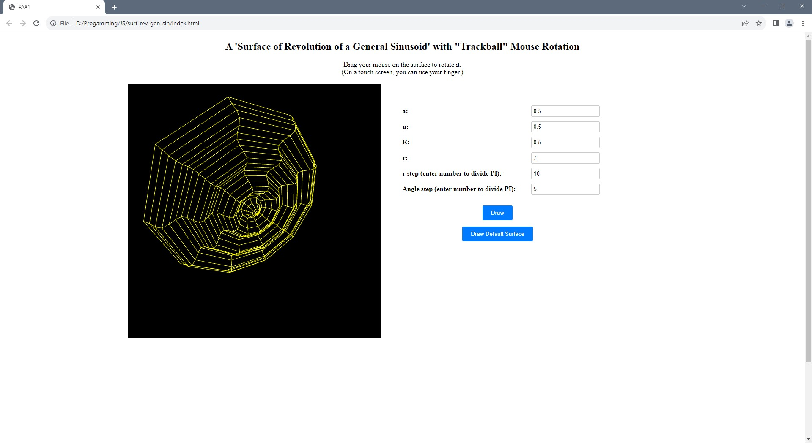
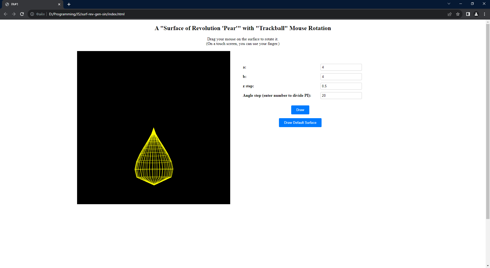

# WebGL

Project that accompanies VGGI credit module.

Visit vggi-kpi.blogspot.com for more information

## Surface of Revolution of a General Sinusoid

Example of surface when you start the program for the first time:

Example of surface when was changed some parameters on UI:
